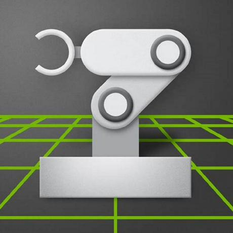

# Simulation & RL Setup — Isaac Sim & MuJoCo for the Booster K1

This guide sets up the full **simulation and reinforcement-learning (RL) stack** for the
Booster K1 — the two simulators the K1 pipeline uses and every Booster repository you need to
clone:

<p>
  
  &nbsp;&nbsp;&nbsp;&nbsp;
  
</p>

- **NVIDIA Isaac Sim + Isaac Lab** — the GPU-accelerated simulator where policies are *trained*
  (thousands of K1s in parallel). Used by `booster_train`.
- **MuJoCo** — a fast, lightweight physics engine used for *sim2sim* verification before you
  ever touch the real robot. Used by `booster_deploy` and `booster_gym`.

> **Heads up — this is the GPU-heavy part of the stack.** Training needs an NVIDIA RTX GPU.
> MuJoCo sim2sim runs on a normal machine (even CPU-only, slowly). If you only want to *watch*
> a pre-trained K1 policy, jump straight to [Part 6 (MuJoCo)](#part-6--mujoco-the-sim2sim-engine)
> and [Part 7 (booster_deploy)](#part-7--booster_deploy-run-a-policy-in-mujoco) — `booster_deploy`
> ships ready-to-run K1 policies, no training required.

---

## 0. How the Pieces Fit Together

The K1 RL pipeline is **train in Isaac Lab → export the policy → run it everywhere** (MuJoCo
first, then the real robot) with the *same* policy code:

```
                 ┌─────────────────────┐
   booster_assets│  K1 models (URDF/    │  ← shared robot descriptions + motion data
   ──────────────│  MJCF) + motions     │
                 └──────────┬──────────┘
                            │ (used by every stage)
            ┌───────────────┼────────────────────────────┐
            ▼               ▼                             ▼
   ┌─────────────────┐  ┌──────────────────┐    ┌──────────────────────┐
   │  booster_train  │  │   booster_deploy │    │ booster_robotics_sdk │
   │ Isaac Lab / Sim │─▶│  MuJoCo sim2sim  │───▶│   real K1 (sim2real) │
   │  TRAIN a policy │  │  (verify safely) │    │   on the robot       │
   └─────────────────┘  └──────────────────┘    └──────────────────────┘
        (RTX GPU)         (any machine, CPU ok)     (Jetson on the robot)
```

There are **two** training frameworks. Use the right one:

| Framework | Simulator | Robot | Status |
|-----------|-----------|-------|--------|
| **`booster_train`** | Isaac Lab 2.2 / Isaac Sim 5.0 | **K1** (BeyondMimic motion tracking) | ✅ Current — use this for the K1 |
| **`booster_gym`** | Isaac Gym Preview 4 | T1 (locomotion) | 🕸️ Legacy — T1 only, optional |

---

## 1. The Booster Repository Ecosystem

Everything is **public** on GitHub under [`BoosterRobotics`](https://github.com/BoosterRobotics).

| Repo | What it is | Robot | Needed for |
|------|------------|-------|------------|
| [`booster_assets`](https://github.com/BoosterRobotics/booster_assets) | Robot descriptions (URDF + MuJoCo MJCF) and example motion data | K1 & T1 | **Everything** (shared) |
| [`booster_train`](https://github.com/BoosterRobotics/booster_train) | RL training on **Isaac Lab** (BeyondMimic motion tracking) | **K1** | Training K1 policies |
| [`booster_deploy`](https://github.com/BoosterRobotics/booster_deploy) | Unified sim2sim (MuJoCo/Webots) + sim2real runner | K1 & T1 | Running policies in MuJoCo / on the robot |
| [`booster_gym`](https://github.com/BoosterRobotics/booster_gym) | Legacy RL framework on **Isaac Gym** | T1 | Optional (T1 locomotion) |
| [`booster_robotics_sdk`](https://github.com/BoosterRobotics/booster_robotics_sdk) | C++/Python control SDK (FastDDS) | K1 & T1 | Deploying to the **real** robot |
| [`booster_robotics_sdk_ros2`](https://github.com/BoosterRobotics/booster_robotics_sdk_ros2) | ROS 2 message/service definitions | K1 & T1 | ROS 2 integration |

### Clone them all

We'll keep everything under `~/booster`:

```bash
mkdir -p ~/booster && cd ~/booster

git clone https://github.com/BoosterRobotics/booster_assets.git
git clone https://github.com/BoosterRobotics/booster_train.git
git clone https://github.com/BoosterRobotics/booster_deploy.git
git clone https://github.com/BoosterRobotics/booster_gym.git              # optional (T1)
git clone https://github.com/BoosterRobotics/booster_robotics_sdk.git     # for the real robot
git clone https://github.com/BoosterRobotics/booster_robotics_sdk_ros2.git
```

### ⚠️ Use three separate Python environments

These projects need **incompatible** Python versions — do **not** install them all into one env.

| Environment | Python | Key packages | Used by |
|-------------|--------|--------------|---------|
| `isaaclab` (conda) | **3.11** | `torch 2.7.0+cu128`, Isaac Sim 5.0, Isaac Lab 2.2 | `booster_train` |
| `deploy-env` (venv) | **3.10+** | `mujoco`, `torch`, `scipy` | `booster_deploy`, MuJoCo, `booster_assets` |
| `boostergym` (conda) | **3.8** | `torch 2.0+cu118`, Isaac Gym Preview 4 | `booster_gym` (legacy) |

> `booster_assets` is `pip install -e .` and gets installed **into whichever env needs it**
> (typically both `isaaclab` and `deploy-env`).

---

## 2. System Requirements

| | Training (Isaac Sim/Lab) | Sim2Sim (MuJoCo) |
|--|--|--|
| OS | Ubuntu 22.04 LTS | Ubuntu 22.04 LTS |
| GPU | NVIDIA **RTX** with RT cores (RTX 3060+; **RTX 3090 / 4090 recommended**) | Any GPU, or CPU-only |
| VRAM | 16 GB min · 24 GB comfortable | — |
| Driver | **≥ 580.65.06** | — |
| GLIBC | **≥ 2.35** (`ldd --version`) — Ubuntu 22.04 default ✅ | — |
| RAM | 32 GB+ | 8 GB+ |
| Disk | ~100 GB free, SSD strongly preferred | ~5 GB |

> ⚠️ Isaac Sim requires a GPU **with RT cores** (consumer RTX or RTX PRO). Data-center cards
> without RT cores (A100/H100) are **not** supported. A 24 GB RTX card (e.g. RTX 3090) is ideal.

---

## Part 3 — Isaac Sim + Isaac Lab (the training simulator)


Isaac Sim is NVIDIA's GPU physics simulator; **Isaac Lab** is the RL framework that runs on top
of it. `booster_train` is **tested with Isaac Lab 2.2 and Isaac Sim 5.0** — we pin those versions.
<br clear="left" />

### Option A — pip install (recommended)

```bash
# 1. Create the env (Isaac Lab needs Python 3.11)
conda create -n isaaclab python=3.11 -y
conda activate isaaclab
pip install --upgrade pip

# 2. PyTorch built for CUDA 12.8
pip install torch==2.7.0 torchvision==0.22.0 --index-url https://download.pytorch.org/whl/cu128

# 3. Isaac Sim 5.0 (pip wheels from NVIDIA's index — ~15-20 min, several GB)
pip install 'isaacsim[all,extscache]==5.0.0' --extra-index-url https://pypi.nvidia.com

# 4. First launch builds the extension cache (~10 min) — accept the EULA when prompted
isaacsim
```

```bash
# 5. Install Isaac Lab itself, pinned to the version booster_train targets
cd ~/booster
git clone https://github.com/isaac-sim/IsaacLab.git
cd IsaacLab
git checkout v2.2.0
sudo apt install -y cmake build-essential
./isaaclab.sh --install        # installs rsl_rl, rl_games, skrl, etc.
```

**Verify Isaac Lab works** (opens a black viewport, then exits cleanly):

```bash
./isaaclab.sh -p scripts/tutorials/00_sim/create_empty.py
```

A heavier smoke test — train a stock humanoid for a few iterations:

```bash
./isaaclab.sh -p scripts/reinforcement_learning/rsl_rl/train.py --task Isaac-Humanoid-v0 --headless
```

> 📎 **Version pairing matters.** Isaac Sim and Isaac Lab are tightly coupled. `booster_train`
> targets **Isaac Lab 2.2 ↔ Isaac Sim 5.0**. (For reference, Isaac Lab 2.3.x / `main` also accept
> Isaac Sim 5.1.) If you hit import errors, a version mismatch is the usual cause. The official
> guide is the source of truth: <https://isaac-sim.github.io/IsaacLab/main/source/setup/installation/index.html>

### Option B — NGC container (no local install)

NVIDIA ships a pre-built training image so you can skip the dependency dance. Requires Docker +
the [NVIDIA Container Toolkit](https://docs.nvidia.com/datacenter/cloud-native/container-toolkit/latest/install-guide.html).

```bash
# Grab the current tag from the catalog page, then:
docker pull nvcr.io/nvidia/isaac-ml-training:<TAG>
docker run --gpus all -it --rm nvcr.io/nvidia/isaac-ml-training:<TAG>
```

Catalog (find the latest tag here): <https://catalog.ngc.nvidia.com/orgs/nvidia/containers/isaac-ml-training>

---

## Part 4 — booster_assets (shared robot models)

Both training and deployment load the K1 from here, so install it **into every env that needs it**.

```bash
conda activate isaaclab          # (repeat later inside deploy-env too)
cd ~/booster/booster_assets
pip install -e .
```

What's inside (`robots/K1/`):

| File | Description |
|------|-------------|
| `K1_22dof.urdf` / `K1_22dof.xml` | Full 22-DoF K1 (URDF for Isaac, **MJCF `.xml` for MuJoCo**) |
| `K1_locomotion.urdf` | Locomotion variant (head + arms fixed) |
| `K1_22dof-ZED.urdf` | 22-DoF with ZED camera mounts |

It also ships example K1 motions in `motions/K1/` (e.g. `k1_fight_001_30fps.csv`,
`k1_mj2_seg1_50fps.csv`) used by the motion-tracking tasks below.

---

## Part 5 — booster_train (train a K1 policy in Isaac Lab)

With the `isaaclab` env active and `booster_assets` installed:

```bash
conda activate isaaclab
cd ~/booster/booster_train

# Install this project into the Isaac Lab Python env
python -m pip install -e source/booster_train
```

> If Isaac Lab is *not* in your active conda/venv, replace `python` with
> `~/booster/IsaacLab/isaaclab.sh -p` in every command below.

### Prepare motion data (BeyondMimic tracking)

The K1 tasks track a reference motion. Convert a CSV from `booster_assets` into the `.npz` the
trainer expects:

```bash
python scripts/csv_to_npz.py --headless \
  --input_file  ~/booster/booster_assets/motions/K1/k1_fight_001_30fps.csv \
  --input_fps   30 \
  --output_name ~/booster/booster_assets/motions/K1/k1_fight_001.npz
```

### List the available K1 tasks

```bash
python scripts/list_envs.py
```

Verified K1 task IDs in the current repo:

| Task ID | Motion |
|---------|--------|
| `Booster-K1-Fight_001-v0` | Fighting sequence |
| `Booster-K1-MJ_Dance_002-v0` | MJ dance segment |
| `Booster-K1-MJ_Dance_004-v0` | MJ dance segment |

(Each also has a `…-v0-Play` variant for evaluation.)

### Train

```bash
python scripts/rsl_rl/train.py --task Booster-K1-Fight_001-v0 --headless --device cuda:0
```

Logs and checkpoints land in `logs/rsl_rl/<experiment>/<run>/`. Watch progress with TensorBoard:

```bash
tensorboard --logdir logs
```

### Evaluate + export for deployment

```bash
python scripts/rsl_rl/play.py --task Booster-K1-Fight_001-v0-Play --checkpoint <PATH_TO_CHECKPOINT>
```

This also **exports** the trained policy to TorchScript/ONNX under
`logs/rsl_rl/<experiment>/<run>/exported/` — that file is what `booster_deploy` runs next.

---

## Part 6 — MuJoCo (the sim2sim engine)


MuJoCo is the fast, lightweight physics engine used to verify a policy in a *different* simulator
before deploying to hardware — catching sim-specific overfitting. It runs anywhere (GPU optional).
<br clear="left" />

```bash
# Deployment env — Python 3.10+
python3 -m venv ~/booster/deploy-env
source ~/booster/deploy-env/bin/activate
pip install --upgrade pip

pip install mujoco                        # DeepMind's modern bindings (bundles the engine)

# Optional: rendering libs (and headless support on servers)
sudo apt install -y libglfw3 libegl1 libosmesa6
```

**Verify + load the K1 model:**

```bash
python -c "import mujoco; print('MuJoCo', mujoco.__version__)"

# Empty interactive viewer
python -m mujoco.viewer

# Load the K1 directly (drag-to-orbit, double-click a joint to perturb)
python -m mujoco.viewer --mjcf ~/booster/booster_assets/robots/K1/K1_22dof.xml
```

> 🖥️ **Headless / SSH (no display)?** Set the GL backend before running:
> `export MUJOCO_GL=egl` (GPU) or `export MUJOCO_GL=osmesa` (CPU). That's what the
> `libegl1` / `libosmesa6` packages above are for.

---

## Part 7 — booster_deploy (run a policy in MuJoCo)

This is the payoff: **`booster_deploy` ships pre-trained K1 policies**, so you can watch the K1
fight/dance in MuJoCo *without training anything*.

```bash
source ~/booster/deploy-env/bin/activate

# booster_assets must be installed in THIS env too
cd ~/booster/booster_assets && pip install -e .

cd ~/booster/booster_deploy
pip install -r requirements.txt
```

### List tasks, then run sim2sim

```bash
python scripts/deploy.py --list
```

Verified registered tasks (policies bundled in `tasks/.../models/`):

| Task | Robot | Motion |
|------|-------|--------|
| `k1_fight` | K1 | Fighting sequence |
| `k1_mj2` | K1 | MJ dance |
| `t1_walk` | T1 | Walking |

Launch a K1 policy in MuJoCo:

```bash
python scripts/deploy.py --task k1_fight --mujoco
python scripts/deploy.py --task k1_mj2   --mujoco
```

> If a task can't find the robot model, point it at your checkout:
> `export BOOSTER_ASSETS_DIR=~/booster/booster_assets` and re-run.

To run your **own** policy from Part 5, register a new task under `booster_deploy/tasks/`
pointing `checkpoint_path` at your exported `.pt` (see the task files above as templates).

---

## Part 8 — booster_robotics_sdk (deploy to the real K1)

⚠️ **Do this only once your policy behaves correctly in MuJoCo.** Keep the robot on its
handle/stand and clear the surrounding area before running anything on hardware.

The SDK is built **on the robot** (Jetson Orin NX, aarch64, Ubuntu 22.04). SSH in
(`ssh booster@192.168.10.102`), then:

```bash
git clone https://github.com/BoosterRobotics/booster_robotics_sdk.git
cd booster_robotics_sdk
sudo ./install.sh                 # FastDDS + build deps

# Build with the Python bindings (needed by booster_deploy)
pip3 install pybind11 pybind11-stubgen
mkdir build && cd build
cmake .. -DBUILD_PYTHON_BINDING=on
make -j$(nproc)
sudo make install
```

> The Python SDK is also available pre-built: `pip install booster_robotics_sdk_python --user`.

Then run the **same** policy on hardware — copy `booster_deploy` to the robot and:

```bash
source /opt/booster/BoosterRos2Interface/install/setup.bash   # ROS 2 low_state/joint_ctrl
pip install -r requirements.txt
python3 scripts/deploy.py --task k1_fight                     # no --mujoco = real robot
```

**Requires Booster firmware ≥ v1.4.** Follow the on-screen prompts (the robot eases into the
prepare pose before the policy takes over).

---

## Part 9 — booster_gym (legacy, T1 only — optional)

`booster_gym` is the older Isaac Gym framework. The K1 lives in `booster_train`; use `booster_gym`
only for **T1 locomotion**. Isaac Gym Preview 4 is deprecated by NVIDIA and must be downloaded
manually (free NVIDIA developer account).

```bash
conda create -n boostergym python=3.8 -y
conda activate boostergym
conda install numpy=1.21.6 pytorch=2.0 pytorch-cuda=11.8 -c pytorch -c nvidia

# Download Isaac Gym Preview 4 from https://developer.nvidia.com/isaac-gym/download
tar -xzvf IsaacGym_Preview_4_Package.tar.gz
cd isaacgym/python && pip install -e .
```

Isaac Gym needs its libs on `LD_LIBRARY_PATH` (otherwise `libpython3.8` isn't found). Wire it to
the conda env:

```bash
mkdir -p $CONDA_PREFIX/etc/conda/activate.d
echo 'export OLD_LD_LIBRARY_PATH=${LD_LIBRARY_PATH}
export LD_LIBRARY_PATH=$LD_LIBRARY_PATH:$CONDA_PREFIX/lib' > $CONDA_PREFIX/etc/conda/activate.d/env_vars.sh
mkdir -p $CONDA_PREFIX/etc/conda/deactivate.d
echo 'export LD_LIBRARY_PATH=${OLD_LD_LIBRARY_PATH}
unset OLD_LD_LIBRARY_PATH' > $CONDA_PREFIX/etc/conda/deactivate.d/env_vars.sh
conda activate boostergym   # reactivate to apply
```

```bash
cd ~/booster/booster_gym
pip install -r requirements.txt

python train.py       --task=T1                    # train
python play.py        --task=T1 --checkpoint=-1    # evaluate in Isaac Gym
python play_mujoco.py --task=T1 --checkpoint=-1    # cross-check in MuJoCo
python export_model.py --task=T1 --checkpoint=-1   # export *.pt for the SDK
```

---

## Verification Checklist

Run these once setup is done:

```bash
# --- Isaac Lab (isaaclab env) ---
conda activate isaaclab
cd ~/booster/IsaacLab && ./isaaclab.sh -p scripts/tutorials/00_sim/create_empty.py   # window opens, exits clean
cd ~/booster/booster_train && python scripts/list_envs.py | grep Booster-K1          # K1 tasks listed

# --- MuJoCo + deploy (deploy-env) ---
source ~/booster/deploy-env/bin/activate
python -c "import mujoco; print('MuJoCo', mujoco.__version__)"
python -c "import booster_assets; print('booster_assets OK')"
cd ~/booster/booster_deploy && python scripts/deploy.py --list                        # shows k1_fight, k1_mj2, t1_walk
python scripts/deploy.py --task k1_fight --mujoco                                      # K1 moves in MuJoCo 🎉
```

---

## Troubleshooting

**`pip install isaacsim …` fails / `GLIBC_2.3x not found`**
Isaac Sim's wheels need **GLIBC ≥ 2.35** (Ubuntu 22.04+). Check with `ldd --version`. Ubuntu 20.04
(GLIBC 2.31) is not supported — upgrade the OS or use the [NGC container](#option-b--ngc-container-no-local-install).

**Isaac Sim first launch hangs for ~10 minutes**
Normal — it's pulling and caching extensions from the registry. Subsequent launches are fast.

**Isaac Lab import errors / version mismatch**
Almost always an Isaac Sim ↔ Isaac Lab version mismatch. `booster_train` wants **Isaac Lab 2.2 /
Isaac Sim 5.0**. Confirm with `pip show isaacsim` and `git -C ~/booster/IsaacLab describe --tags`.

**`torch.cuda.is_available()` is `False`**
Driver problem. Run `nvidia-smi`; if it errors, `sudo ubuntu-drivers autoinstall && sudo reboot`.
Make sure the installed torch matches your CUDA (`cu128` wheels for CUDA 12.x).

**MuJoCo viewer: black window / `GLFW`/`GL` error**
Install the GL libs (`sudo apt install libglfw3 libegl1 libosmesa6`). On a headless box set
`export MUJOCO_GL=egl` (or `osmesa` for pure CPU) before launching.

**`booster_deploy` can't find the K1 model**
`export BOOSTER_ASSETS_DIR=~/booster/booster_assets` and confirm `booster_assets` is `pip install -e .`
in the *active* env.

**Isaac Gym: `libpython3.8.so.1.0: cannot open shared object file`**
The `LD_LIBRARY_PATH` activate hook in [Part 9](#part-9--booster_gym-legacy-t1-only--optional) isn't
applied — re-run `conda activate boostergym`.

**`booster_train` motion `.npz` not found at train time**
You skipped the `csv_to_npz.py` step, or `--output_name` doesn't match the path the task expects
(under `booster_assets/motions/K1/`). Re-run the conversion.

---

## References

- **Isaac Sim docs** — <https://docs.isaacsim.omniverse.nvidia.com/latest/installation/>
- **Isaac Lab** (repo + install guide) — <https://github.com/isaac-sim/IsaacLab> · <https://isaac-sim.github.io/IsaacLab/main/source/setup/installation/index.html>
- **NGC `isaac-ml-training` container** — <https://catalog.ngc.nvidia.com/orgs/nvidia/containers/isaac-ml-training>
- **MuJoCo docs** — <https://mujoco.readthedocs.io/>
- **Booster repos** — [assets](https://github.com/BoosterRobotics/booster_assets) · [train](https://github.com/BoosterRobotics/booster_train) · [deploy](https://github.com/BoosterRobotics/booster_deploy) · [gym](https://github.com/BoosterRobotics/booster_gym) · [SDK](https://github.com/BoosterRobotics/booster_robotics_sdk)
- **K1 Manual (Booster Wiki)** — <https://booster.feishu.cn/wiki/E3q5wF5SnitXZgkY18Uc8odBnXb>
</content>
</invoke>
